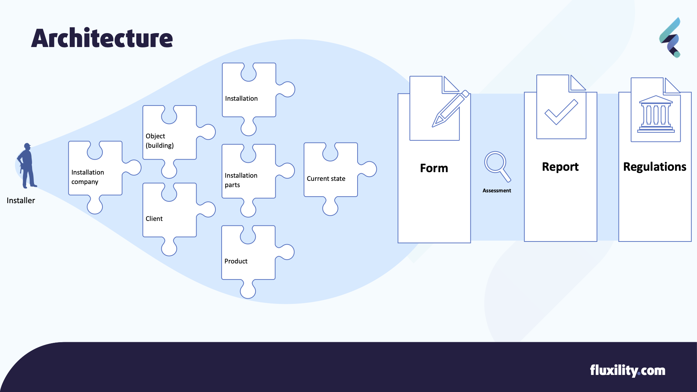

Architecture & Models
======================

This section provides a basic structure and an insight in the Entities (including definitions) involved for which
this Forms API is designed. Terms will be specified in both English and Dutch.

.. contents:: Table of Contents
   :depth: 2
   :local:
   :backlinks: none

Architecture
------------
Forms are a means for an Installer to describe a situation and produce a Report that is in turn being required by
some sort of Regulation. Regulations can be anything from actual law to in private defined certifications.
The image below explains the flow and relevant/available information in setting up the (digital) Form and the
reporting to relevant institutions. Each entity (piece) is explained below.

Entity definitions
-------------------

.. _Entity Form:

Form (formulier / protocol /checklist)
######################################
The main entity will be the `Form` (eg. protocol, checklist etc) with checklist items for installing, maintaining or
inspecting an Installation in an Object (ie. building). These forms are defined and maintained by experts or expert groups
and are provided
by for instance `Techniek Nederland <https://www.technieknederland.nl>`_ or `ISSO <https://isso.nl>`_. From a
reporting perspective, forms should be designed in such a way that it will never ask questions that do not lead
to data ending up in the report.

.. _Entity Report:

Report (inspectierapport / rapportage)
######################################
The `Report` is a (finalized) document including information on the checklist items provided by the filled out `Form`
and a conclusion drawn upon this information. The Reports content must comply to rules as stated by the regulations.

.. _Entity Regulations:

Regulations (BRL, NTR, NTA, NEN, ISO)
######################################
Most of these forms are created with regulations in mind, or even created
to fully comply with these regulations. Regulations can be governed by certifying instance, government etc.

.. _Entity Installing Company:

Installation company (Installatiebedrijf, Installateur)
########################################################
A company involved in (the execution of) installing, maintaining or inspecting the technical product(s) inside an
Object (building). In order to carry specific tasks, installing companies and their personnel needs to be certified.

.. _Entity Installing Person:

Installer (Monteur, Inspecteur, Installateur)
#############################################
The actual person performing the work of installing, maintaining or inspecting a product. An Installer must
always work for an Installation Company. On most occasions both Installer and Installation Company
need to be certified to fulfill the task at hand. Keep in mind that the Installer (person)
can be the only person working at the Installation Company.

.. _Entity Object:

Object (Building, Gebouw, Bouwwerk, Pand, Werkadres)
#####################################################
Most of the times an Object will be a building, but it could also be for instance a meadow (solar panels).
Objects in the Netherlands are registered by the Kadaster.
Each Object (and sub-object) is documented with a unique Kadaster ID (VBO), also known as BAG ID. See
https://www.kadaster.nl/zakelijk/producten/adressen-en-gebouwen/bag-api-individuele-bevragingen and
https://catalogus.kadaster.nl/bag/nl/page/Verblijfsobject.

.. _Entity Client:

Client (Opdrachtgever)
#######################
The Client is the person or company who commissioned the installation, maintenance of inspection. In most casees
this will be the owner or responsible person of the installation.

.. note::
    In the near future this definition needs to be improved, because there
    are many roles of responsibility towards an installations. For instance the owner of the building, the owner
    of the installation, the user of the installation etc.

.. _Entity Installation:

Installation (System, Installatie, Systeem)
###########################################
An Installation is a Product that is installed and serving it's purpose in or on an Object.

.. _Entity Parts:

Installation Parts (Installatie-onderdeel, Sub-systeem)
#######################################################
Installations form a hierarchy (tree), where each Installation might consist of sub-installations. For instance

* Central Heating System consist
    * Heat generator
        * burner
        * expansion vessel
    * Radiator
    * Gas transport towards generator
    * Water transport to radiators

Maintenance or inspection activities can be performed for the complete installation or specifically aimed at just one
sub-installation.

Product data (stored in 2BA)
#######################################################
Actual information on products (non-installed) can be found in the `2BA Product database <https://2ba.nl/>`_.
It holds a rich set of products with all their features described (in `ETIM <https://www.etim-international.com/>`_),
making it easy to uniformly enter information on the installation
that is being inspected. The product information is provided to 2BA by the manufactures themselves
and therefore quite accurate. This data can be used to prefill forms when describing the installed product.

Current State
##############
The whole reason for filling out the form will be the Current State of the Installation. This covers anything from
'having a new Installation installed' to 'a leakage' to 'actual power consumption compared to factory standards' and
of course the amount CO and CO2 being produced by the installation.

Classification systems
--------------------------------------

NL/SFB
#######

There is a Dutch classification standard for describing types of installations and product. It's a determination to
with each level becoming more specific. Level one is 'heating', 'cooling' etc, level two can be 'central', 'local' etc,
and the deepest can be type of fuel used. See https://ketenstandaard.nl/standaard/nl-sfb/.

ETIM
####

A second standard for product classification is ETIM. Where NL/SFB is focussed mainly on creating groups of products,
ETIM also aims at defining all properties of products in a standardised way. See https://www.etim-international.com/.

