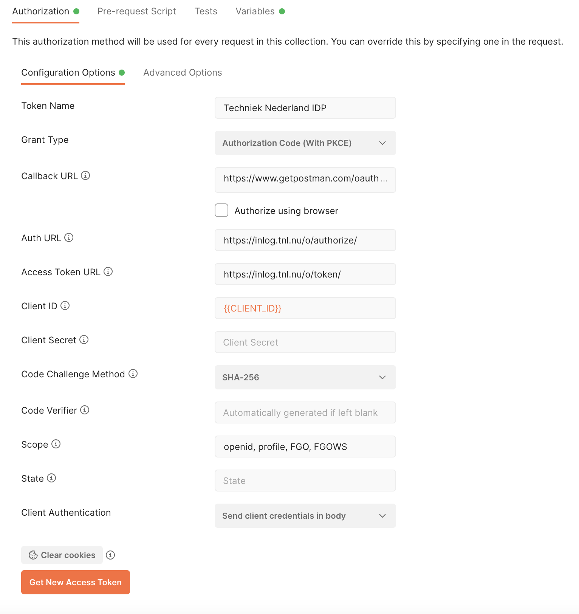

User Authentication
--------------------

Learn how to guide users through the login process, enabling them to access Techniek Nederland's web services.
Detailed instructions will be provided on utilizing the OAuth protocol to authenticate users via the Techniek Nederland IDP.

Basic Concept of the Login Process:
===================================

#. User opens your Application and needs to log in.
#. Your Application redirects the User to the Identity Provider (IDP), providing information to the IDP about your application, the actions you want to perform on behalf of the user, and where the IDP should redirect the user within your application after successful login.
#. The User logs in to the IDP using their credentials.
#. The IDP informs the User about the actions your Application wants to perform on their behalf and requests their permission.
#. The IDP redirects the User back to the specified address of your Application, along with a unique code that can be used to perform actions on behalf of this user.
#. The following sections will provide further details on this process, including example HTTP requests. We recommend utilizing existing OAuth implementations to handle the authentication flow, which would eliminate the need for manually constructing raw HTTP requests.

Step 1: Register Your Application with Techniek Nederland
==========================================================

To use the IDP, your application needs to have identification credentials registered with Techniek Nederland.
In this tutorial, we assume your application is unable to securely store secrets. Examples include web browser-based
applications (JavaScript applications) or applications installed on the user's computer. Since these applications
are visible to the user, they cannot securely store secrets. Therefore, we will only use a client_id in combination
with PKCE (Proof Key for Code Exchange), rather than a client_id and client_secret.

To register your application, please send an email to `Remco van der Linden <r.vanderlinden@TechniekNederland.nl>`_ with the following information:

* Application name
* Why your going to use the IDP
* The `redirect_url` - the address(es) to which the user should be redirected after a successful login attempt

When making the request, ensure that you provide the complete URL, not just the domain. For example,
'https://myapplication.com/oauth-callback/'. Also, consider providing any development addresses you would like to
include, such as 'http://localhost:8000/oauth-callback/' and 'https://www.getpostman.com/oauth2/callback'.

Step 2: Configure Your Application
==========================================================

In this step, we will describe the information you receive from Techniek Nederland and demonstrate
how to test it using Postman.

After registering your application with Techniek Nederland, you will receive a `client_id`. This is
a unique identifier that allows the IDP to identify your application. The `client_id`
should be included in your application's code and in your requests to the IDP.
It can be seen by the user and is therefore considered public.

You will need the following information:

:authorization_endpoint:    https://inlog.tnl.nu/o/authorize/
:token_endpoint:            https://inlog.tnl.nu/o/token/
:userinfo_endpoint:         https://inlog.tnl.nu/o/userinfo/
:openid-configuration:      https://inlog.tnl.nu/o/.well-known/openid-configuration/
:client_id:                 To be requested r.vanderlinden@TechniekNederland.nl
:client_secet:              *Not applicable for client applications*
:grant_type:                Authorization code (make sure to use PKCE)
:scopes:                    openid, profile, FGO, FGOWS

.. NOTE::

    The meaning of these terms is beyond the scope of this documentation. We kindly refer
    to the documentation of the OAuth library you choose, or alternatively, resources such as
    Auth0, which provide clear explanations of these terms.

With this information, you can now configure your application. In this tutorial, we will describe
how you can configure Postman.

#. Open Postman.
#. Choose 'New' > 'Workspace'.
#. Name it 'Techniek Nederland'.
#. Click 'New' > 'Collection' and name it 'Identity Service Provider'.
#. Open 'Identity Service Provider' in the left side menu.
#. You will now see the content, and the 'Authorization' tab is active.
#. The 'Type' is currently set to "No Auth". Change it to 'OAuth2'.
#. Go to 'Configure new token' and select 'edit' if necessary.
#. Set the Token Name to 'Techniek Nederland IDP' (you can choose any name you prefer).
#. Fill in the configuration details (refer to the screenshot as well).
#. Click 'Get New Access Token'.

Continue to Step 3 for further instructions.

Please note that the provided screenshot is for reference only, and the actual configuration may differ
based on your specific OAuth implementation and Postman version.

Step 3: Authorize your application to act on the user's behalf
===============================================================

In the authorization step, you will authorize your application to perform actions on behalf of the user. It's
important to note that this step is about authorizing your application, not the user authorizing themselves.
To authorize, you will redirect the user to the Identity Service Provider (IDP) and request the IDP to grant
access to specific data and actions (scopes) on behalf of the user. If the user grants permission, your
application will receive a temporary authorization code (access_code), which will be used in the next step
to request access.

Generating the PKCE code is beyond the scope of this tutorial.

When using a library (or Postman), the user is redirected to the IDP for authorization. If you choose to
implement the call yourself, it would look like the following (note that this call is not performed in the
background, you actually redirect the user to this address):

.. http:get:: https://inlog.tnl.nu/o/authorize/

    Authorize your application to access resources on behalf of a user.

    :queryparam response_type: The response type. Set to "code".
    :queryparam client_id: Your client ID.
    :queryparam scope: The requested scope (eg. "openid, profile, FGO, FGOWS").
    :queryparam redirect_uri: The redirect URI after successful authorization.
    :queryparam code_challenge: The code challenge generated using PKCE.
    :queryparam code_challenge_method: The code challenge method. Set to "S256".

    .. sourcecode:: http

        GET /o/authorize/?response_type=code&client_id=YOUR_CLIENT_ID&scope=openid%2C%20profile%2C%20FGO%2C%20FGOWS&redirect_uri=https%3A%2F%2Fwww.getpostman.com%2Foauth2%2Fcallback&code_challenge=zYiwIX3ekeYZUx6nvnHK_DyonQuKv8zvgABNx0I2qGc&code_challenge_method=S256 HTTP/1.1
        Host: inlog.tnl.nu
        Accept: application/json

A web browser will open the login screen of Techniek Nederland's IDP. Log in with your Techniek Nederland account.
During the first login, you will be asked to grant permission for your application to log in on your behalf as
the logged-in user. Once the user grants permission, they will be redirected to the address specified in the
redirect_uri parameter. This request will include the code parameter, which you will use in step 4 to retrieve
the access token.

.. http:get:: https://www.getpostman.com/oauth2/callback

    The redirect URI of your own application. For demonstration purposes we use Postman, but in your application
    this will definetly be something else.

    :queryparam code: The authorization code received from the authorization server which you need in the next step

    .. sourcecode:: http

        GET /oauth2/callback?code=ABCDEFGabcdefg0123456789 HTTP/1.1
        Host: www.getpostman.com

Step 4: Obtaining an access token
=================================

With the temporary authorization code from setp 3, you can now request an `access token` and related information.
The access token is ultimately the means by which you can retrieve data on behalf of the user. For example, you can
use it to request information about the user from the IDP or access other web services that the user has
granted you permission to.

It's important to note that the access code is also temporary. For security reasons, the access token expires
after a certain period of time. This is crucial because the access token is shared with external entities, such as
other web services. That's why you also receive a `refresh token`. You should only share this token with the IDP and
only share it once, when requesting a new set of access tokens, refresh tokens, etc. The refresh token can only be
used once, and after that, you will receive a new one. Finally, you also receive an `id token` (when using the
openid scope). This token contains encoded user information, but how to decode it is beyond the scope of this tutorial
to cover its details.

How the code_verifier was generated is beyond the scope of this tutorial.

In step 2 your hit the 'Get New Access Token' in Postman. Step 3 and step 4 are performed automatically
after the user gives permission. You will now see the 'token details' provided by the IDP. If you want to make
the http call manually, you can use the following HTTP request:

.. http:post:: https://inlog.tnl.nu/o/token/

    Request access token

    :reqheader Content-Type: application/x-www-form-urlencoded

    :form grant_type: The grant type. Set to "authorization_code".
    :form code: The authorization code received in the previous step.
    :form redirect_uri: The originating redirect URI
    :form code_verifier: PKCE code verifier
    :form client_id: The client id.

    .. sourcecode:: http

        POST /o/token/ HTTP/1.1
        Host: inlog.tnl.nu
        Content-Type: application/x-www-form-urlencoded

        grant_type=authorization_code&code=ABCDEFGabcdefg0123456789&redirect_uri=https%3A%2F%2Fwww.getpostman.com%2Foauth2%2Fcallback&code_verifier=Pd9Sju1dCBVoegn-eViAME-jctqBFcAsOiJaULxopbY&client_id=ABCDEFGabcdefg0123456789ABCDEFGabcdefg0123456789

    **Example response**

    .. sourcecode:: http

        HTTP/1.1 200 OK
        Content-Type: application/json

        {
          "access_token": "ABCDEFGabcdefg0123456789",
          "expires_in": 36000,
          "token_type": "Bearer",
          "scope": "openid profile",
          "refresh_token": "ABCDEFGabcdefg0123456789",
          "id_token": "eyJ0...---"
        }

Your application is now authorized to make requests on behalf of the user. You've reach the end of this tutorial and
can now continue to the `User Data Retrieval` tutorial where we will explain how to use your token to obtain
user info.
